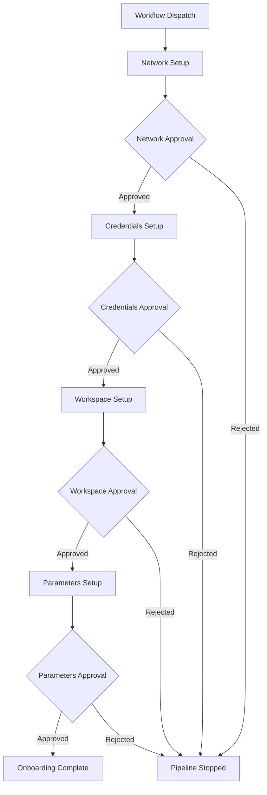

# Onboarding Pipeline - Environment Setup Guide

This guide explains how to configure GitHub Environments for the approval gates in the onboarding pipeline.

## Overview

The onboarding pipeline has 4 sequential stages, each requiring manual approval:

1. **Network Setup** → `network-approval` environment
2. **Credentials Setup** → `credentials-approval` environment  
3. **Workspace Setup** → `workspace-approval` environment
4. **Parameters Setup** → `parameters-approval` environment

## Setting Up GitHub Environments

### Prerequisites
- Repository admin access
- GitHub Pro/Team/Enterprise (required for environment protection rules)

### Step 1: Create Environments

1. Navigate to your repository on GitHub
2. Go to **Settings** → **Environments**
3. Click **New environment** and create these environments:
   - `network-approval`
   - `credentials-approval`
   - `workspace-approval`
   - `parameters-approval`

### Step 2: Configure Environment Protection Rules

For each environment, configure the following protection rules:

#### Required Reviewers
- Add specific users or teams who can approve each stage
- Recommended: Different reviewers for different stages based on expertise

#### Wait Timer (Optional)
- Set a minimum wait time before deployment can proceed
- Recommended: 5-10 minutes for review time

#### Allowed Branches
- Restrict which branches can deploy to each environment
- Recommended: `main`, `develop`, `release/*`

### Step 3: Environment-Specific Configuration

#### Network Approval Environment
```yaml
Environment Name: network-approval
Required Reviewers: 
  - Network team members
  - Infrastructure architects
Protection Rules:
  - Required reviewers: 2
  - Wait timer: 5 minutes
```

#### Credentials Approval Environment  
```yaml
Environment Name: credentials-approval
Required Reviewers:
  - Security team members
  - DevOps engineers
Protection Rules:
  - Required reviewers: 2
  - Wait timer: 10 minutes
```

#### Workspace Approval Environment
```yaml
Environment Name: workspace-approval
Required Reviewers:
  - Platform team members
  - Application owners
Protection Rules:
  - Required reviewers: 1
  - Wait timer: 5 minutes
```

#### Parameters Approval Environment
```yaml
Environment Name: parameters-approval
Required Reviewers:
  - Technical leads
  - Product owners
Protection Rules:
  - Required reviewers: 1
  - Wait timer: 5 minutes
```

## Pipeline Flow

### Stage Dependencies


### Approval Process

1. **Trigger**: User runs workflow dispatch with inputs
2. **Network Stage**: 
   - Creates network infrastructure
   - Pauses for `network-approval` environment approval
   - Reviewers can see network details and approve/reject
3. **Credentials Stage**:
   - Uses network outputs from previous stage
   - Creates service accounts and credentials
   - Pauses for `credentials-approval` environment approval
4. **Workspace Stage**:
   - Uses network and credentials from previous stages
   - Sets up compute and storage resources
   - Pauses for `workspace-approval` environment approval
5. **Parameters Stage**:
   - Uses all previous stage outputs
   - Configures application parameters
   - Pauses for `parameters-approval` environment approval
6. **Completion**: Final summary and notifications

### Approval Interface

When each stage requires approval, reviewers will see:
- **Stage Details**: What resources are being created
- **Configuration**: Input parameters and computed values
- **Dependencies**: Outputs from previous stages
- **Links**: Direct links to AWS console resources
- **Approval Options**: Approve or Reject with comments

## Usage Instructions

### Running the Pipeline

1. Go to **Actions** tab in GitHub
2. Select **"Onboarding Pipeline with Approvals"**
3. Click **"Run workflow"**
4. Fill in required inputs:
   - Tenant Name
   - Environment (dev/stage/prod)
   - Network CIDR
   - AWS Region
   - Feature toggles (monitoring, backup)

### Monitoring Progress

- Each stage shows progress in the Actions UI
- Approval requests appear as pending deployments
- Reviewers receive notifications for pending approvals
- Stage outputs are visible in job logs and summaries

### Handling Failures

- If any stage fails, the pipeline stops
- Failed stages can be re-run individually
- Approval rejections stop the pipeline
- All stages show detailed error information

## Best Practices

### Reviewer Assignment
- **Network**: Infrastructure/Platform teams
- **Credentials**: Security/DevOps teams  
- **Workspace**: Application/Product teams
- **Parameters**: Technical leads/Product owners

### Security Considerations
- Use different reviewers for different stages
- Require multiple approvers for production environments
- Set appropriate wait timers for review
- Audit approval decisions regularly

### Monitoring & Alerts
- Monitor pipeline execution times
- Alert on approval delays
- Track success/failure rates by stage
- Review rejected approvals for patterns

## Troubleshooting

### Common Issues

1. **Missing Environment**: Create the required environment in Settings
2. **No Reviewers**: Add required reviewers to environment protection rules
3. **Permission Denied**: Ensure reviewers have appropriate repository access
4. **Timeout**: Increase wait timer or follow up with reviewers

### Debug Information

Each stage provides detailed logging:
- Input parameters and validation
- Resource creation status  
- Configuration details
- Integration test results
- Links to created resources

For issues, check:
- Workflow run logs for each stage
- Environment approval history
- Resource creation logs in AWS console
- GitHub audit logs for approval actions