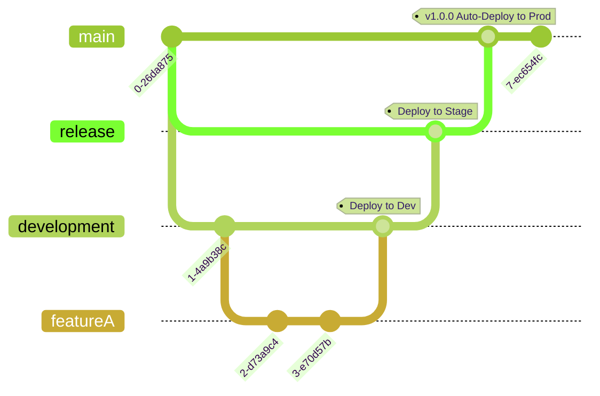

## Problem Statement
Long lived branches and redundant approvals for same changes.

* When a new feature or change is implemented, a PR is raised to merge feature branch with dev branch and once it is deployed successfully in ephem environment and getting required approvals, the branch is merged, triggering a deployment to DEV environment.
  

* This same process is followed against the other two branches (Release and Main).
* Ideally this is the best practice, however, coming to infrastructure, having multiple environments, we're making repetetive actions though not required.
* Changes made in the feature branch and deployed to DEV environment can be merged to main without having to go through the *release* and *main* approval phase.

## Proposed Change to Branching strategy

* As per this Strategy, we only have two branches *main* and *release* . Any changes will be commited to the feature branch (cut from release).
* Once the changes to the respective environemnt (dev,stage,demo,prod) are done, we follow the usual path to raise a PR to be merged to *release*. This triggers the ephem deployment to validate the changes. After the checks and the PR approval, merge is done to release.
* Based on the changes to respective folder(dev,stage,demo,prod), the environemnt specific deployment is triggered.
* Once the deployment is success, these changes are merged to *main* with a PR that triggers a plan against the PROD environment. If the plan outcomes no changes to PROD environment, changes are auto merged to main branch.
* If the plan outcomes changes to PROD, we wait for approvals.

## Requried workflow changes

* Changes to workflow to trigger deployments based on folder changes.
* Auto PR request from *release* to *main* when the deployment to DEV/STAGE is success.
* Auto approval and merge based on checks for the above PR.